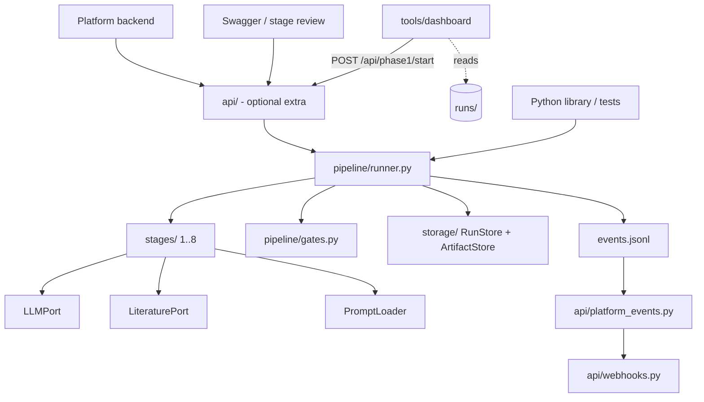

# Architecture

idea2hypothesis is one engine with two ways in: a Python library and an HTTP API. The same
`run_pipeline` / `resume_pipeline` functions serve the Platform backend routes, the per-stage
Swagger routes and the tests.



## Layers

| Package | Responsibility |
| --- | --- |
| `config.py` | Typed, frozen configuration with eight sections. Unknown keys or wrong types raise `ConfigError` naming the dotted path. `Config.snapshot()` contains no credentials. |
| `pipeline/` | `models.py` (stage, status, request, result, `Services`, `StageContext`), `ports.py` (protocols), `contracts.py` (per-stage rules and validators), `gates.py` (review modes, gate payloads, screening drops, light-mode advisories), `events.py` (core event model), `control.py` (cooperative pause/cancel, one worker per run), `usage.py` (token and cost metering), `services.py` (`build_services` wires real clients from config), `runner.py` (orchestration). |
| `stages/` | One module per stage, each exposing `async run(ctx) -> list[str]` (warnings). `base.py` holds the JSON request/repair loop. Stages read inputs only from `ctx.artifacts` and write only their own `stage-NN` directory. |
| `literature/` | `providers/` (OpenAlex, Semantic Scholar, arXiv over httpx with retry, rate spacing and a circuit breaker), `search.py` (multi-query search with per-source error recording and an optional cache), `dedup.py`, `citations.py` (BibTeX), `novelty.py` (heuristic assessment). |
| `llm/` | `LLMPort` and models, OpenAI-compatible client, AWS Bedrock Converse client (boto3 imported lazily, called through `asyncio.to_thread`), shared retry and model-fallback chain, robust JSON extraction (`parsing.py`), optional pricing. |
| `prompts/` | `stages.yaml` (stage prompts and shared blocks), `hypothesis_roles.yaml`, `domains/hep.yaml` and `biology.yaml` overrides (the default `ml` set is in `stages.yaml`), `loader.py` (strict rendering, user override file, content-hash snapshot). Loaded through `importlib.resources`, so it works from an installed wheel. |
| `storage/` | `RunStore` (run record, checkpoint, events, platform-id index) and `ArtifactStore` (stage files, manifests, attempt versioning). All writes use a temporary file and `os.replace`. |
| `memory/` | Optional ideation memory (past topics, hypotheses, anti-patterns) with a hashing embedding; stored under `<runs_root>/_memory`. |
| `resources/` | Read-only local hardware detection for the stage 1 advisory. |
| `api/` | FastAPI app, run service, Platform event mapping and webhook delivery. Depends on the `api` extra; the core never imports it. |

Core imports (`import idea2hypothesis`, `pipeline`, `stages`, `literature`, `llm`, `prompts`,
`storage`) need only `pyyaml` and `httpx`; boto3 and FastAPI are only imported when used.

## Public interface

```python
async def run_pipeline(request: RunRequest, services: Services) -> RunResult
async def resume_pipeline(run_id: str, services: Services) -> RunResult
async def execute_stage(stage: Stage, context: StageContext) -> StageResult
async def answer_gate(run_id, gate_id, answer: GateAnswer, services) -> RunResult
async def pause_run(run_id, services) -> RunResult      # also cancel_run, recover_interrupted
```

`Services` carries the LLM, literature port, prompt loader, run store, optional event sink,
reviewer LLM and ideation memory. Everything is injected, which is how tests run the full
pipeline with fixtures.

## A run

1. `run_pipeline` creates `runs/<run-id>/` with `run.json`, `config.snapshot.json` (no secrets) and
   `prompts.snapshot.json`, emits `run.started`, then drives stages 1 to 9 in order.
2. For each stage the runner skips it if the checkpoint says it completed in this attempt and the
   manifest hashes still match; otherwise `execute_stage` checks the inputs (`MISSING_INPUT`),
   runs the stage, retries bounded times on transient provider errors, validates the contract,
   and writes `manifest.json`. Results are recorded in `checkpoint.json`.
3. After a stage that has a gate in the run's review mode, the runner opens it (see below) and
   returns with the run `awaiting_review`; no worker is held while waiting.
4. After stage 8 the run is `completed`. `resume_pipeline` on a completed run returns the stored
   result and writes nothing.

Failures end the run as `failed` with a code (see
[stage-contracts.md](stage-contracts.md)). No stage ever produces substitute content.

### Run and stage states

* Run: `running`, `awaiting_review`, `paused`, `completed`, `failed`, `cancelled`.
* Stage (checkpoint): `completed` or `failed`; `StageStatus` also defines `pending`, `running`,
  `awaiting_review`, `paused` and `cancelled` for consumers.
* Pause and cancel are cooperative: they take effect at the next safe point (between LLM or
  provider operations), never mid-request. Provider requests have finite timeouts. Without an
  active worker they apply immediately.
* A budget (`budget_usd`) is enforced only when pricing is configured; exceeding it pauses the run
  at a stage boundary with reason `budget_exceeded`. Without pricing no cost is reported.
* One worker per run: an in-process lock plus the `worker` field of `run.json`. After a crash, a
  run still marked `running` is moved to `paused` (`interrupted`) by `recover_interrupted`; it is
  never restarted automatically.

### Review modes and gates

| Mode | Gates | Notes |
| --- | --- | --- |
| `auto` | none | schema, evidence and empty-shortlist checks still apply |
| `light` | none | `stage.completed` events carry `advisories` from quality checks |
| `copilot` | screening gate after stage 5, hypotheses gate after stage 8 | default |
| `full` | scope gate after stage 2, screening gate after stage 5, hypotheses gate after stage 8 | |

`gate.opened` carries the shortlist (screening), the goal, sub-questions and topic evaluation
(scope), or the hypotheses with their sources and standing objections, the held-back candidates
and the open tensions (hypotheses). Approving a screening gate may list `dropped` paper ids, which
are removed from `shortlist.jsonl`, `review.json` and `screen_meta.json` (dropping everything
fails the run with `EMPTY_SHORTLIST`). Approving a hypotheses gate may list `dropped` hypothesis
ids and `kept` held-back candidates; a kept one must pass the hypothesis contract on its own and
joins the set marked contested. Rejecting moves stages from the rollback point into
`attempts/<n>/`, starts a new attempt and carries the reviewer note into the prompts of the redone
stages: the screening gate rolls back to stage 3, the scope gate to stage 1, the hypotheses gate
to stage 8. An approved gate before the rollback point stays approved. Gate ids look like
`gate-s05-a1` (stage and attempt).

## Storage layout

```text
runs/
  _index/platform/<platform_run_id>.json     idempotency index for the Platform API
  _memory/                                   ideation memory (optional)
  <run-id>/
    run.json                status, review_mode, attempt, topic, error, gate, usage, worker
    config.snapshot.json    names of env vars and profiles only
    prompts.snapshot.json   rendered prompt texts and a content hash
    checkpoint.json         per-stage status, gates, attempt
    events.jsonl            append-only, fsynced, sequence assigned under a per-run lock
    stage-01/ ... stage-09/ artifacts plus manifest.json
    partial/stage-NN/attempt-<n>/  parts kept while a stage runs (scored batches, cards,
                            perspectives), reused when the stage is paused or retried
    llm_calls/stage-NN/attempt-<n>/NNNN-<label>.json  every model call as sent and answered:
                            request, raw response, model id, tokens, outcome and the
                            contract errors that sent an answer back
    attempts/<n>/stage-NN/  outputs replaced by a rejected gate or an edited upstream artifact
```

The API adds `platform_events.jsonl` and `delivery.json` in the run directory (see
[platform-integration.md](platform-integration.md)). The filesystem backend is meant for a single
API process; multiple workers or hosts are not supported.

## Events

Core events: `schema_version`, `run_id`, `seq`, `stage`, `type`, `timestamp`, `attempt`, `data`.
Types: `run.started`, `stage.started`, `stage.progress`, `stage.completed`, `stage.failed`,
`gate.opened`, `gate.resolved`, `run.paused`, `run.resumed`, `run.cancelled`, `run.failed`,
`run.completed`. `stage.progress` (`data.kind`, `stage_run`, `try`) announces a persisted part of
a running stage (`StageContext.progress`); `kind` `restart` means a transient model error started
the stage again and the parts announced before it are void.
They are persisted before any observer is notified and describe only what happened. The API
translates them, together with the real artifacts, into the Platform event envelope; the UI
groups stages as scope (1, 2), search (3, 4), screen (5), read (6), synthesize (7) and
hypothesize (8).

## LLM and literature behaviour

* The LLM layer retries transient failures with exponential backoff and jitter, walks the
  configured `fallback_models`, classifies non-retryable errors, strips reasoning tags and
  extracts JSON objects robustly from fenced or chatty replies. Missing credentials raise
  `LLMConfigError` when services are built, not in the middle of a run.
* The OpenAI-compatible client streams completions: `llm.timeout_sec` is the longest silence
  between two chunks, so a long answer that keeps arriving is not cut off, and a whole call is
  capped at 15 minutes. A router that ignores `stream` and returns one JSON body still works.
* Stages ask for one JSON object per prompt. An invalid answer is sent back once per allowed
  retry with the list of errors; if it is still invalid the stage fails (`LLM_OUTPUT_INVALID`).
* Screening pre-filters candidates by keyword overlap (listed in `review.json` as `prefiltered`
  with no scores) and scores the rest in batches with the model; papers the model did not
  score are excluded as `unscored`.
* Stage 8 generates hypotheses per perspective role, optionally runs debate rounds
  (`llm.debate_rounds`; each a critique of the others with a severity per challenge, every
  challenged author's answer to each challenge, and every critic's review of those answers)
  judged by the reviewer model, then merges the candidates that survived into the final set,
  which must settle at least one synthesis tension when there are any. Without a
  reviewer model the judge is the main model and a warning says it is not independent.
* The literature cache (`literature.cache`) stores earlier real responses under
  `storage.cache_root`; it is used only when a provider call fails and the entry is under 30 days
  old.

## Developer tools

`tools/serve_api.py` loads `I2H_CONFIG` and runs uvicorn. `tools/dashboard/` is a read-mostly
viewer: `server.py` serves the static page and a live `data.js` built by `build_data.py` from
`runs/<run-id>`; the "Run phase 1" button posts to `POST {I2H_API_URL}/api/phase1/start`.
Neither is part of the wheel or a dependency of the engine.
