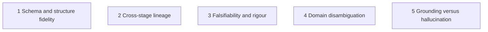

# LLM reliability benchmark

A rubric for comparing language models inside the idea2hypothesis pipeline. It answers one
question: can this model be trusted to produce scoped, grounded, falsifiable research output when
the contracts in [stage-contracts.md](stage-contracts.md) are enforced?

The rubric originates from the six-group reliability framework written for the Platform frontend
(`Scope`, `Search`, `Screen`, `Read`, `Synthesize`, `Hypothesize`). It is kept, but re-expressed on
the real artifacts of the eight core stages. Fluent prose proves nothing; reliability is measured
on structure, lineage, falsifiability, disambiguation and grounding.

| UI group | Core stages | Main artifacts |
| --- | --- | --- |
| Scope | 1, 2 | `goal.json`, `problem_tree.json`, `topic_evaluation.json` |
| Search | 3, 4 | `queries.json`, `candidates.jsonl`, `search_meta.json` |
| Screen | 5 | `shortlist.jsonl`, `review.json` |
| Read | 6 | `cards/*.json` |
| Synthesize | 7 | `synthesis.json` |
| Hypothesize | 8 | `hypotheses.json`, `perspectives/`, `novelty_report.json` |

## 1. Five dimensions and the composite score



$$\text{CRS} = 0.20\,S_{\text{schema}} + 0.25\,S_{\text{lineage}} + 0.25\,S_{\text{falsify}} + 0.15\,S_{\text{disambig}} + 0.15\,S_{\text{grounding}}$$

Each $S_i \in [0, 10]$ comes from the automatic checks below. The pipeline already enforces most of
them as hard contracts, so the useful signal when comparing models is how many repair rounds a
model needs, how often a stage ends with a contract error code, and the warnings it produces.

| Dimension | What is counted | Where it shows up |
| --- | --- | --- |
| Schema | first-attempt JSON validity, number of repair rounds, `LLM_OUTPUT_INVALID` | `warnings` of `stage.completed`, stage failures |
| Lineage | references that resolve (sub-question, paper, card, gap ids) | contract errors `INVALID_*` |
| Falsify | falsification criteria with a concrete failing observation, prediction diversity | stage 8 contract, warning on same-direction portfolios |
| Disambiguation | false-friend papers rejected, off-topic topics refused | `review.json` decisions, `TOPIC_NOT_RESEARCHABLE` |
| Grounding | numbers in synthesis absent from cards, nulls instead of invented card fields, scores only for scored papers | contract warnings, `unscored` count |

## 2. Per-group rubric

Weights are within the group.

### Scope (stages 1 and 2)

| Code | Criterion | Pass condition | Weight |
| --- | --- | --- | :---: |
| `SCO-VAL-01` | Out-of-scope guard | A casual or non-empirical topic (for example "How to troubleshoot intermittent home Wi-Fi issues") gives `researchable: false` with a `rejection_reason`; the run ends `TOPIC_NOT_RESEARCHABLE`. Accepting it fails the whole benchmark for that model. | 25% |
| `SCO-MEC-02` | MECE sub-questions | At least 3 sub-questions with unique ids and priorities; no two near-duplicates (text similarity); together they cover the topic's key terms | 25% |
| `SCO-SMA-03` | SMART goal | `problem`, `objective`, `scope` present and `success_criteria` contains measurable criteria (interval, effect size, threshold) | 20% |
| `SCO-LIN-04` | Goal link | every sub-question has a `goal_link`; risks, if present, reference existing sub-question ids | 15% |
| `SCO-EVL-05` | Honest evaluation | `topic_evaluation.json` scores in `[0, 10]`; a vague topic scores below `research.min_topic_score` rather than being inflated; no performance numbers asserted in the goal | 15% |

### Search (stages 3 and 4)

| Code | Criterion | Pass condition | Weight |
| --- | --- | --- | :---: |
| `SEA-ANG-01` | Orthogonal strategies | at least 2 strategies (3 recommended) covering different angles: phenomenon, mechanism or baseline, method or measurement | 25% |
| `SEA-LEN-02` | Short queries | queries are short keyword phrases (about 3 to 6 words); sentences are shortened, empty or duplicate queries removed | 30% |
| `SEA-MAP-03` | Linked to sub-questions | every query lists existing `sub_question_ids` | 20% |
| `SEA-REA-04` | Real papers only | every candidate has `source_records` with a provider, source id and retrieval time; no candidate is created without a provider response; `references.bib` has one entry per candidate | 15% |
| `SEA-DED-05` | Deduplication | no two candidates share a DOI, arXiv id or normalised title; `search_meta.json` reports `raw`, `unique`, `duplicates` and per-source errors | 10% |

### Screen (stage 5)

| Code | Criterion | Pass condition | Weight |
| --- | --- | --- | :---: |
| `SCR-DEC-01` | Total accounting | every candidate has a decision (`kept`, `rejected`, `unscored`, `prefiltered`) and a reason; kept equals the shortlist | 25% |
| `SCR-SCO-02` | Scores only for scored papers | scores in `[0, 1]` for kept papers; `unscored` and `prefiltered` papers carry `null`, never defaults | 25% |
| `SCR-DIS-03` | False-friend rejection | on the polysemy scenario below, papers sharing a keyword but belonging to another field are rejected with `false_friend` set and a domain-mismatch reason | 35% |
| `SCR-HIT-04` | Human gate | papers dropped by the reviewer are removed from `shortlist.jsonl`, `review.json` and every later stage; dropping all fails with `EMPTY_SHORTLIST` | 15% |

### Read (stage 6)

| Code | Criterion | Pass condition | Weight |
| --- | --- | --- | :---: |
| `REA-ATO-01` | One card per shortlisted paper | `card-<paper_id>` for each paper with an abstract; skipped papers are listed with a reason | 30% |
| `REA-NUL-02` | Unknown is null | fields not supported by the abstract are `null`; `evidence_scope` is `abstract` unless real full text was used; no template phrases | 40% |
| `REA-LIM-03` | Useful limitations | `limitations` names a concrete methodological weakness (design, sample, confounder), not "more research is needed" | 30% |

### Synthesize (stage 7)

| Code | Criterion | Pass condition | Weight |
| --- | --- | --- | :---: |
| `SYN-COV-01` | Card coverage | clusters reference only existing cards; ideally every card is in a cluster | 25% |
| `SYN-TEN-02` | Real tension | the tension between clusters names a genuine theoretical or empirical disagreement | 20% |
| `SYN-GAP-03` | Gap lineage | at least 2 gaps, each with existing `sub_question_ids` and `card_ids`, and text that follows from those cards' limitations | 40% |
| `SYN-NUM-04` | No invented numbers | zero "does not appear in any card" warnings | 15% |

### Hypothesize (stage 8)

| Code | Criterion | Pass condition | Weight |
| --- | --- | --- | :---: |
| `HYP-DIV-01` | Prediction diversity | with 3 or more hypotheses, not all predictions equal; at least one `> 0` and one `< 0` or `≠ 0` | 25% |
| `HYP-FAL-02` | Falsifiability | `falsification_criteria` names a concrete failing observation (threshold, interval, zero crossing), consistent with the `prediction` | 30% |
| `HYP-UNI-03` | Anti-degeneracy | `novelty` and `rationale` are distinct per hypothesis (the contract rejects near-duplicates); mechanisms differ | 20% |
| `HYP-LIN-04` | Lineage | `gap_id` resolves to a synthesis gap; `evidence_refs` resolve to cards or shortlisted papers | 15% |
| `HYP-DEB-05` | Perspective structure | at least two perspective outputs; with `llm.debate_rounds > 0`, rebuttal rounds and a judge record exist | 10% |

## 3. Test scenarios

Run each scenario with each model under the same configuration, fixed `temperature`, and compare
the codes above.

1. **Happy case A, behavioural science.** Topic: "Impact of objective sleep duration and
   circadian consistency on standardized exam scores"; domains cognitive psychology, neuroscience,
   educational analytics. Expect all eight stages to finish with valid contracts, 3 to 4
   MECE sub-questions, short queries, and hypotheses with diverse predictions.
2. **Happy case B, systems and ML.** Topic: "Stale or Malicious? Disconnection-Induced Failures
   of History-Based Byzantine Defences in Asynchronous Federated Learning"; domains distributed
   systems, machine learning, adversarial robustness. Expect gaps drawn from method limitations
   (for example assumptions about bounded delay) and falsifiable, quantified hypotheses.
3. **Out-of-scope topic.** "How to troubleshoot intermittent home Wi-Fi connectivity issues". A
   reliable model returns `researchable: false` at stage 1 and the run stops there, with no
   papers, cards or hypotheses. An unreliable model rewrites it into a pseudo-academic question
   and the pipeline continues.
4. **Polysemy trap.** "Disconnection-induced staleness in distributed gradient optimization".
   At stage 5 papers about stale HTTP cache validation or stale quotes in high-frequency trading
   must be rejected as other-field matches.

## 4. What makes a hypothesis reliable

Reliability of `hypotheses.json` does not depend on how convincing it reads but on five pillars.

1. **Popperian falsifiability.** A claim is scientific only if some observation would prove it
   wrong. Weak models write "sleep has a significant effect on exam results" (true for any
   outcome) or "wrong if there is no improvement". A good criterion states the zone: for
   `> 0`, wrong if the 95 percent interval includes zero or lies below it; for `< 0`, wrong if
   it touches zero or shows a gain; for `≠ 0`, wrong if the interaction term touches zero.
2. **Quantified estimand.** `exposure`, `outcome`, `estimand` and `method` are operational, for
   example exposure "hours of actigraphy-measured sleep per night against the student's
   baseline", outcome "standardised exam score in SD units", estimand "within-subject regression
   coefficient", method "fixed-effects panel regression". Placeholders such as `sleep`, `score`
   and `test` fail.
3. **Directional diversity.** A real portfolio contains main effects, costs or losses and
   interactions or mediation. All hypotheses predicting `> 0` is a confirmation-bias collapse; the
   pipeline warns about it.
4. **Unique mechanisms.** Every `rationale` and `novelty` text is distinct and names a mechanism.
   Copying one template across hypotheses ("Derived from literature limitations") is rejected by
   the contract.
5. **Lineage.** The chain is explicit and checkable:

   ```text
   sub-question -> query -> paper -> card limitation -> gap -> hypothesis
   ```

   `gap_id`, `sub_question_ids` and `evidence_refs` store the links.

### Strong versus weak behaviour

| Stage group | Reliable model | Unreliable model | Risk |
| --- | --- | --- | --- |
| Scope | refuses non-research topics; MECE questions; measurable goal | accepts anything; overlapping questions; invented baselines | the whole run is spent on an ill-posed problem |
| Search | angles differ; short queries | one angle; sentence queries | low recall, missed key work |
| Screen | separates relevance from quality; rejects false friends; leaves unknowns unscored | keyword matching; keeps off-field papers; scores everything | garbage into evidence extraction |
| Read | `null` where the abstract is silent; concrete limitations | narrative summaries; invented details | no usable gaps |
| Synthesize | clusters and a genuine tension; gaps traced to cards | paper-by-paper listing; untraceable gaps | no novelty |
| Hypothesize | falsifiable, diverse, mechanism-specific | unfalsifiable, one direction, copy-pasted text | pseudo-scientific hypotheses |

## 5. Hypothesis Reliability Score (HRS)

$$\text{HRS} = 2.5\,M_{\text{falsify}} + 2.5\,M_{\text{diversity}} + 2.0\,M_{\text{anti}} + 1.5\,M_{\text{quant}} + 1.5\,M_{\text{lineage}}$$

Each $M \in [0, 1]$, so HRS is on a 0 to 10 scale. Compute it from a stage 8 `hypotheses.json`:

```python
import json
import re
from pathlib import Path

CONCRETE = re.compile(r"[<>=≥≤≠]|\d|\b(zero|interval|threshold|include|touch)\w*", re.I)


def hypothesis_reliability(path: str, valid_gaps: set[str]) -> dict[str, float]:
    items = json.loads(Path(path).read_text(encoding="utf-8"))["hypotheses"]
    n = len(items)
    falsify = sum(
        1 for h in items
        if len(str(h.get("falsification_criteria", ""))) >= 25
        and CONCRETE.search(str(h["falsification_criteria"]))
    ) / n
    predictions = {h.get("prediction") for h in items}
    diversity = 1.0 if "> 0" in predictions and predictions & {"< 0", "≠ 0"} else 0.2
    anti = (
        len({h.get("novelty", "").strip() for h in items}) / n
        + len({h.get("rationale", "").strip() for h in items}) / n
    ) / 2
    quant = sum(
        1 for h in items
        if h.get("exposure") and h.get("outcome") and h.get("estimand")
        and len(h.get("statement", "")) > 40
    ) / n
    lineage = sum(
        1 for h in items
        if h.get("gap_id") in valid_gaps and h.get("sub_question_ids") and h.get("evidence_refs")
    ) / n
    total = 2.5 * falsify + 2.5 * diversity + 2.0 * anti + 1.5 * quant + 1.5 * lineage
    return {
        "M_falsify": falsify, "M_diversity": diversity, "M_anti": anti,
        "M_quant": quant, "M_lineage": lineage, "HRS": round(total, 2),
    }
```

Interpretation: a model that satisfies every check scores 9 to 10. Raw models without the
contracts typically collapse to single-direction predictions, vague criteria and repeated text
and score far lower. Because the pipeline rejects such output, the practical measure for a
production model is how many repair rounds it needs to reach a valid `hypotheses.json`.

## 6. Running the checks in this repository

The contract-level assertions of the rubric are tests; they run offline against fixture ports
(`tests/fixtures/`), so they verify the pipeline, not a particular model:

```bash
python -m pytest tests/contracts -q
python -m pytest tests/integration -q
```

Relevant tests: `tests/contracts/test_stage_contracts.py` (lineage, falsification criteria,
unscored papers without scores, null card fields),
`tests/integration/test_options.py::test_duplicate_novelty_text_is_sent_back_for_repair`
(anti-degeneracy), `tests/integration/test_stops_and_failures.py` (non-researchable topic,
empty literature, reject-all screening, invalid JSON never reported as completed) and
`tests/unit/test_prompts.py::test_reliability_rules_are_in_the_prompts`.

To compare real models, run each scenario in section 3 through the API or `run_pipeline` with the
model under test (`llm.model`, or a Bedrock model id), then compute CRS from the run's
`events.jsonl` (repair warnings, failure codes) and HRS from `stage-08/hypotheses.json`. A live
comparison needs your own credentials and is not part of the automated suite.
