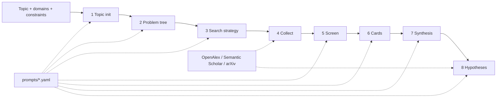

# Pipeline stage guide (stages 1 to 8)

What each stage does, the principle behind it, where its input comes from and what it leaves on
disk. Exact pass conditions are in [stage-contracts.md](stage-contracts.md); module structure is in
[architecture.md](architecture.md). The stage numbers and names follow the
pipeline this project was extracted from ([INSPIRE.md](../INSPIRE.md)).

How the prompts work: `prompts/stages.yaml` holds one entry per stage with a system and a user
template, shared blocks (`evidence_rules`, `json_rules`) and sub-prompts for the debate. Every
stage prompt asks for a single JSON object. Domain files (`prompts.domain`: `ml` default, `hep`,
`biology`) replace only the entries they define; `prompts.override_file` lets you replace more.
Each run stores the rendered prompts and a content hash in `prompts.snapshot.json`. There is no
runtime skill matcher: domain guidance is part of these prompt files.

Review modes decide where a human is asked: `copilot` gates after stage 5, `full` also after
stage 2, `auto` and `light` never.

## Stage 1: TOPIC_INIT

Module `stages/topic_init.py`. Input: topic, `research.domains`, `research.constraints`, optional
recalled ideation memory (anti-patterns from earlier failed topics).

* **Researchability guard.** The model first decides whether the topic can be framed as an
  empirical or theoretical question with measurable variables. Conversation, personal requests,
  consumer how-to questions, jokes and pure opinions are rejected with a reason; the run ends
  `TOPIC_NOT_RESEARCHABLE` and nothing downstream runs. No goal is invented for them.
* **SMART goal and novelty.** For researchable topics: problem, objective, scope, a
  Specific/Measurable/Achievable/Relevant/Time-bound goal, constraints, success criteria and the
  novel angle (what is not yet well studied). Model names and performance numbers must not be
  asserted here; they are checked against literature later (the evidence rules block in the
  prompt).
* **Hardware advisory** (`research.hardware_advisory: true`): `hardware_profile.json` from local
  read-only detection (NVIDIA via `nvidia-smi`, Apple MPS, else CPU). It informs scope and is
  never acted on.

Output: `goal.json`, `goal.md`, optional `hardware_profile.json`.

## Stage 2: PROBLEM_DECOMPOSE

Module `stages/problem_decompose.py`. Input: `stage-01/goal.json` (plus reviewer feedback after a
rejected scope gate).

* **MECE sub-questions.** At least three prioritised sub-questions that do not overlap but
  together cover the goal, each linked to the goal; ids are referenced by every later stage.
* **Pre-flight topic evaluation.** A separate model call scores novelty, specificity and
  feasibility from 0 to 10; the overall score is their mean. Below `research.min_topic_score`
  (default 5.0) the files are written and the run ends `TOPIC_BELOW_THRESHOLD` with the model's
  suggestion for sharpening the topic.

Output: `problem_tree.json`, `problem_tree.md`, `topic_evaluation.json`. In `full` mode a scope
gate follows; rejecting it reruns from stage 1 with the reviewer's note.

## Stage 3: SEARCH_STRATEGY

Module `stages/search_strategy.py`. Input: `stage-02/problem_tree.json`.

* **Faceted retrieval.** At least two strategies, for example core topic, related methods or
  baselines, and theoretical foundations or adversaries. Each strategy lists queries and the
  sub-questions it serves; unknown sub-question ids are a contract error.
* **Short queries.** Academic APIs perform badly on sentences, so queries are cut down to a few
  keywords (`shorten_query`), de-duplicated across strategies and checked for non-emptiness.
* The configured providers are written to `sources.json`; an optional minimum year comes from
  the plan or `literature.default_year_min`.

Output: `search_plan.yaml`, `queries.json`, `sources.json`.

## Stage 4: LITERATURE_COLLECT

Module `stages/literature_collect.py`, package `literature/`. Input: `stage-03/queries.json`.

* **Recall first.** The planned queries plus a few broader variants (shorter windows of the
  topic, survey/benchmark/comparison forms) are sent to each configured provider, with
  `literature.inter_query_delay_sec` between queries to respect rate limits. Providers retry on
  429/5xx and transport errors; Semantic Scholar has a circuit breaker.
* **Provenance.** Each paper keeps `source_records` (provider, source id, URL, retrieval time).
* **Deduplication.** Papers are merged by DOI, arXiv id or normalised title; the merged record keeps
  all source records, so the same paper found in two providers is one candidate with two records.
* **Honest failures.** A provider error is stored in `search_meta.json` and surfaced as a warning.
  If nothing at all comes back the stage fails with `NO_LITERATURE`; no placeholder papers are
  created, and stages 5 to 8 do not run.
* Credentials: `S2_API_KEY` (optional) and an OpenAlex contact address or key through config.

Output: `candidates.jsonl`, `references.bib` (one entry per candidate), `search_meta.json`.

## Stage 5: LITERATURE_SCREEN

Module `stages/literature_screen.py`. Input: `stage-04/candidates.jsonl`, goal and problem tree.

* **Cheap pre-filter.** Candidates with no keyword overlap with the topic or domains are marked
  `prefiltered` with a reason and no scores; if nothing overlaps, the model judges everything.
* **Dual scoring.** The model, in batches, scores every remaining paper for relevance and
  quality (0 to 1) with a reason: domain match, method relevance, cross-domain rejection, recency
  preference, quality floor. Papers are kept at `research.min_relevance` and
  `research.min_quality` (defaults 0.7 and 0.5).
* **False friends.** Papers that share a keyword but belong to another field are rejected, and
  `false_friend` records the shared word. For the topic "sleep and exam performance", a paper on
  sleep scheduling in sensor networks is rejected, not kept.
* **No default scores.** A paper the model did not score is `unscored`, excluded, and never gets
  a fabricated value. If more than 20 percent of a batch comes back unscored the answer is sent back for repair, and the stage fails if the model still does not comply.
* **Empty shortlist** fails the stage (`EMPTY_SHORTLIST`); stages 6 to 8 do not run.

Output: `shortlist.jsonl`, `review.json` (a decision and reason for every candidate),
`screen_meta.json`. In `copilot` and `full` modes the gate opens here; the reviewer can approve,
drop papers, or reject (rerun from stage 3 with feedback).

## Stage 6: KNOWLEDGE_EXTRACT

Module `stages/knowledge_extract.py`. Input: `stage-05/shortlist.jsonl`.

* **Knowledge atoms.** Each shortlisted paper with an abstract becomes one card: problem, method,
  data, metrics, findings, limitations. Limitations matter most: they are the raw material for
  the research gaps in stage 7.
* **Abstract level only.** Cards are labelled `evidence_scope: "abstract"`. Fields the abstract does not
  support are `null`; nothing is filled in from the model's memory. Papers without an abstract
  are listed under `skipped` in `knowledge_meta.json`. If no card can be made the stage fails
  (`NO_CARDS`).

Output: `cards/<card_id>.json` and `.md`, `knowledge_meta.json`.

## Stage 7: SYNTHESIS

Module `stages/synthesis.py`. Input: all cards, `stage-02/problem_tree.json`.

* **Thematic clustering.** Cards are grouped into schools of approach instead of a paper-by-paper
  list; the synthesis also records tensions between clusters.
* **Evidence-linked gaps.** At least two research gaps, each tied to sub-questions and to the
  cards whose limitations reveal it. A gap that cites a card that does not exist fails the stage.
* **No invented numbers.** Figures in the text that appear in no card are reported as warnings.

Output: `synthesis.json`, `synthesis.md`.

## Stage 8: HYPOTHESIS_GEN

Module `stages/hypothesis_gen.py`. Input: `stage-07/synthesis.json`, cards, research
constraints and, with memory enabled, past anti-patterns.

* **Perspectives.** Hypotheses are generated by several roles in parallel (`ml`: innovator,
  pragmatist, contrarian; `hep` and `biology` have their own roles in
  `prompts/hypothesis_roles.yaml`). Their outputs are stored under `perspectives/`.
* **Optional debate.** With `llm.debate_rounds > 0` each role rebuts the others for that many
  rounds and a judge ranks the results. With `llm.reviewer` configured the judge is an
  independent model; otherwise a warning says it is not independent.
* **Falsifiability.** Every hypothesis states exposure, outcome, estimand, method, a prediction
  (`> 0`, `< 0` or `≠ 0`), a falsification criterion with a concrete failing observation, a
  mechanism (`rationale`), and why it is new (`novelty`), and points to a real gap and to
  evidence (card or paper ids). Rationale and novelty text must differ between hypotheses. A
  portfolio where every hypothesis predicts the same direction triggers a warning.
* **Novelty assessment** (`research.novelty_check`, default true). The hypotheses are compared
  with papers retrieved by new queries and the stage 4 pool; the result is a heuristic score and
  recommendation labelled as an assessment, not proof of novelty.
* If no perspective yields usable hypotheses the stage fails (`NO_PERSPECTIVES`); defaults are
  never substituted.

Output: `hypotheses.json`, `hypotheses.md`, `perspectives/`, `novelty_report.json`. The run is then
`completed`.

## After stage 8

There is no further stage. A downstream consumer (for example an experiment designer) reads
`hypotheses.json` and follows `evidence_refs` and `gap_id` back through `synthesis.json`, cards and
`candidates.jsonl` to the papers.
