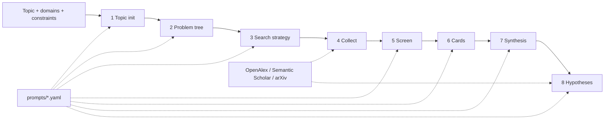

# Pipeline stage guide (stages 1 to 9)

What each stage does, the principle behind it, where its input comes from and what it leaves on
disk. Exact pass conditions are in [stage-contracts.md](stage-contracts.md); module structure is in
[architecture.md](architecture.md). The stage numbers and names follow the
pipeline this project was extracted from ([INSPIRE.md](../INSPIRE.md)).

How the prompts work: `prompts/stages.yaml` holds one entry per stage with a system and a user
template, shared blocks (`evidence_rules`, `json_rules`) and sub-prompts for the debate. Every
stage prompt asks for a single JSON object. Domain files (`prompts.domain`: `ml` default, `hep`,
`biology`) replace only the entries they define; `prompts.override_file` lets you replace more.
Each run stores the prompt templates and a content hash in `prompts.snapshot.json`, and every model
call as it was sent and answered under `llm_calls/` (see below). There is no runtime skill
matcher: domain guidance is part of these prompt files.

Temperature: every prompt that extracts, scores or judges (stages 1 to 7, the argument map and the
debate judge) sets `temperature: 0`, so the same input gives the same answer. Only the prompts that
propose hypotheses (the perspectives, their answers in the debate and the final set) use
`llm.temperature`; the debate critique and review, which judge, run at 0.

Model call log: `runs/<id>/llm_calls/stage-NN/attempt-N/NNNN-<label>.json` holds one record per
call, numbered in call order: the label, the repair round, `outcome` (`accepted`, `rejected` with
the contract errors that sent it back, or `provider_error`), the request (temperature, max tokens,
JSON mode, system prompt and every message) and the response (model id, raw text, tokens, cost,
finish reason). It lives outside `stage-NN`, so rerunning a stage keeps the record of earlier
tries.

Review modes decide where a human is asked: `copilot` gates after stage 5 and after stage 8,
`full` also after stage 2, `auto` and `light` never.

## Stage 1: TOPIC_INIT

Module `stages/topic_init.py`. Input: topic, `research.domains`, `research.constraints`, optional
recalled ideation memory (anti-patterns from earlier failed topics).

* **Researchability guard.** The model first decides whether the topic can be framed as an
  empirical or theoretical question with measurable variables. Conversation, personal requests,
  consumer how-to questions, jokes and pure opinions are rejected with a reason; the run ends
  `TOPIC_NOT_RESEARCHABLE` and nothing downstream runs. No goal is invented for them.
* **SMART goal and novelty.** For researchable topics: problem, objective, scope, a
  Specific/Measurable/Achievable/Relevant/Time-bound goal, constraints, success criteria and the
  novel angle (what is not yet well studied). Model names and performance numbers must not be
  asserted here; they are checked against literature later (the evidence rules block in the
  prompt).
* **Hardware advisory** (`research.hardware_advisory: true`): `hardware_profile.json` from local
  read-only detection (NVIDIA via `nvidia-smi`, Apple MPS, else CPU). It informs scope and is
  never acted on.

Output: `goal.json`, `goal.md`, optional `hardware_profile.json`.

## Stage 2: PROBLEM_DECOMPOSE

Module `stages/problem_decompose.py`. Input: `stage-01/goal.json` (plus reviewer feedback after a
rejected scope gate).

* **MECE sub-questions.** At least three prioritised sub-questions that do not overlap but
  together cover the goal, each linked to the goal; ids are referenced by every later stage.
* **Pre-flight topic evaluation.** A separate model call scores novelty, specificity and
  feasibility from 0 to 10; the overall score is their mean. No literature has been read yet, so
  `topic_evaluation.json` records `basis: "model judgement before any literature search"`: the
  score is the model's prior, not a finding. Below `research.min_topic_score`
  (default 5.0) the files are written and the run ends `TOPIC_BELOW_THRESHOLD` with the model's
  suggestion for sharpening the topic.

Output: `problem_tree.json`, `problem_tree.md`, `topic_evaluation.json`. In `full` mode a scope
gate follows; rejecting it reruns from stage 1 with the reviewer's note.

## Stage 3: SEARCH_STRATEGY

Module `stages/search_strategy.py`. Input: `stage-02/problem_tree.json`.

* **Faceted retrieval.** At least two strategies, for example core topic, related methods or
  baselines, and theoretical foundations or adversaries. Each strategy lists queries and the
  sub-questions it serves; unknown sub-question ids are a contract error.
* **Short queries.** Academic APIs perform badly on sentences, so queries are cut down to a few
  keywords (`shorten_query`), de-duplicated across strategies and checked for non-emptiness.
* The configured providers are written to `sources.json`; an optional minimum year comes from
  the plan or `literature.default_year_min`.

Output: `search_plan.yaml`, `queries.json`, `sources.json`.

## Stage 4: LITERATURE_COLLECT

Module `stages/literature_collect.py`, package `literature/`. Input: `stage-03/queries.json`.

* **Recall first.** The planned queries plus a few broader variants (shorter windows of the
  topic, survey/benchmark/comparison forms) are sent to each configured provider, with
  `literature.inter_query_delay_sec` between queries to respect rate limits. Providers retry on
  429/5xx and transport errors; Semantic Scholar has a circuit breaker.
* **Provenance.** Each paper keeps `source_records` (provider, source id, URL, retrieval time).
* **Deduplication.** Papers are merged by DOI, arXiv id or normalised title; the merged record keeps
  all source records, so the same paper found in two providers is one candidate with two records.
* **Honest failures.** A provider error is stored in `search_meta.json` and surfaced as a warning.
  If nothing at all comes back the stage fails with `NO_LITERATURE`; no placeholder papers are
  created, and stages 5 to 8 do not run.
* Credentials: `S2_API_KEY` (optional) and an OpenAlex contact address or key through config.

Output: `candidates.jsonl`, `references.bib` (one entry per candidate), `search_meta.json`.

## Stage 5: LITERATURE_SCREEN

Module `stages/literature_screen.py`. Input: `stage-04/candidates.jsonl`, goal and problem tree.

* **Cheap pre-filter.** Candidates without an abstract (no card can be built from them) and
  candidates with no keyword overlap with the topic or domains are marked `prefiltered` with a
  reason and no scores, so they never take a shortlist place; if nothing overlaps, the model
  judges every paper that has an abstract.
* **Whole abstracts.** The reviewer model sees the title, year, venue, citation count and the
  whole abstract (results and conclusions usually come last). Only an abstract over 5,000
  characters is cut, and its decision records `abstract_cut_at`; `review.json` `reviewer_view`
  states what the model was shown.
* **Dual scoring.** The model, in batches, scores every remaining paper for relevance and
  quality (0 to 1) with a reason: domain match, method relevance, cross-domain rejection, recency
  preference, quality floor. Papers are kept at `research.min_relevance` and
  `research.min_quality` (defaults 0.7 and 0.5).
* **Anchored scores.** The prompt defines each score band (for relevance, 0.90 means the paper
  studies the question itself and 0.30 means it shares only a term) and asks for two decimals, so
  scores spread across a band instead of piling up on round values. Scores describe the paper and
  the decision applies the rules: a false friend can score high on relevance and still be rejected.
* **Capped shortlist.** At most `research.max_shortlist` papers are kept (default 20; 0 keeps all),
  best relevance first, then quality. Stage 6 reads every kept paper, so the cap bounds its time
  and cost; papers below the cut are `below_cutoff` with their scores and a reason.
* **False friends.** Papers that share a keyword but belong to another field are rejected, and
  `false_friend` records the shared word. For the topic "sleep and exam performance", a paper on
  sleep scheduling in sensor networks is rejected, not kept.
* **No default scores.** A paper the model did not score is `unscored`, excluded, and never gets
  a fabricated value. If more than 20 percent of a batch comes back unscored the answer is sent back for repair, and the stage fails if the model still does not comply.
* **Empty shortlist** fails the stage (`EMPTY_SHORTLIST`); stages 6 to 8 do not run.

Output: `shortlist.jsonl`, `review.json` (a decision and reason for every candidate),
`screen_meta.json`. In `copilot` and `full` modes the gate opens here; the reviewer can approve,
drop papers, or reject (rerun from stage 3 with feedback).

## Stage 6: KNOWLEDGE_EXTRACT

Module `stages/knowledge_extract.py`. Input: `stage-05/shortlist.jsonl`.

* **Knowledge atoms.** Each shortlisted paper with an abstract becomes one card: problem, method,
  data, metrics, findings, limitations. Limitations matter most: they are the raw material for
  the research gaps in stage 7.
* **Abstract level only.** Cards are labelled `evidence_scope: "abstract"`. Fields the abstract does not
  support are `null`; nothing is filled in from the model's memory. A limitation is recorded only
  when the abstract states it, never inferred. Papers without an abstract are listed under
  `skipped` in `knowledge_meta.json`. If no card can be made the stage fails (`NO_CARDS`).
* **Quoted, checked word for word.** For every field it fills, the model copies 1 to 6 passages of
  at least four words from the abstract into `quotes`. The contract compares each passage with the
  abstract after removing only meaningless differences (Unicode forms, curly quotes and dashes,
  HTML tags, letter case, white space, surrounding quote marks and ellipses); words and numbers
  must match. A failing card is sent back with the reasons; if it still fails after the repair
  rounds, the paper gets no card and is listed under `skipped` with the reason, so no card says
  what its abstract does not.

Output: `cards/<card_id>.json` and `.md`, `knowledge_meta.json`.

## Stage 7: SYNTHESIS

Module `stages/synthesis.py`. Input: all cards, `stage-02/problem_tree.json`.

* **Thematic clustering.** Cards are grouped into schools of approach instead of a paper-by-paper
  list.
* **Tensions with both sides on record.** Where cards disagree, the synthesis records a tension
  (`X1`, ...) with its two sides: what each side finds and the cards behind it. A tension whose
  side cites no card, or a card on both sides, fails the answer. When the cards agree there is no
  tension.
* **Evidence-linked gaps.** At least two research gaps, each tied to sub-questions and to the
  cards whose limitations reveal it. A gap that cites a card that does not exist fails the stage.
* **No invented numbers.** Figures in the text that appear in no card are reported as warnings.

Output: `synthesis.json`, `synthesis.md`.

## Stage 8: HYPOTHESIS_GEN

Module `stages/hypothesis_gen.py`. Input: `stage-07/synthesis.json`, cards, research
constraints and, with memory enabled, past anti-patterns.

* **The evidence in every prompt.** Each prompt of the stage (perspectives, critique, answer,
  review, final set) gets the synthesis and, under `cards`, what every card reports (`method`,
  `findings`, `limitations`, 600 characters each), so a hypothesis can be checked against the
  cards it cites: a result a card already reports is `already_established`, a premise a card
  contradicts is `unsupported`.

* **Perspectives.** Hypotheses are generated by several roles in parallel (`ml`: innovator,
  pragmatist, contrarian; `hep` and `biology` have their own roles in
  `prompts/hypothesis_roles.yaml`), 3 or 4 each, so the debate starts from 9 to 12 candidates.
  Their outputs are stored under `perspectives/`.
* **Optional debate.** With `llm.debate_rounds > 0` each round has three phases (module
  `stages/hypothesis_debate.py`):
  * critique: every role challenges or concedes the others' hypotheses and says how serious each
    challenge is: `fatal` only for one of four named flaws (not supported by the cards, cannot
    fail, a test that cannot decide it, already shown by a card it must cite), else `caveat`;
  * answer: every challenged role answers each challenge: it revises the hypothesis, defends it
    citing the cards (and may argue a fatal challenge is only a caveat), or withdraws it, and may
    add a replacement. No challenge may go unanswered, and an answer must do what it says;
  * review: every critic judges the answers to its own challenges, `resolved` or `stands` (with
    what the answer leaves unaddressed, at the same severity or lowered, never raised), and
    critiques the added hypotheses.

  An objection is settled by its critic's review, not by the author's claim to have fixed it, and
  no one is asked to agree: a disagreement that stands is recorded. Withdrawn hypotheses leave the
  debate, the judge's view and the final merge. A judge then ranks the positions, seeing what
  still stands against each. With `llm.reviewer`
  configured the judge is an independent model; otherwise the main model judges,
  `debate_record.json` records `independent_judge: false` and a warning says so.
* **The final set.** Every candidate that survived, merged where two say the same thing, between
  `research.min_hypotheses` and `research.max_hypotheses` (default 3 to 6). A candidate with a
  fatal objection standing is used only to reach the minimum and is then marked `contested`;
  otherwise it is `held_back`, on record with its objection. Caveats that stand are added to the
  hypothesis's limitations. Each hypothesis names its sources in `from`; a merged one says in
  `merge_note` what it takes from each, and candidates that disagree (a different sign, or one
  saying the effect is too small or conditional) are kept apart. Every other candidate left out
  is `not_used` with its reason: a duplicate of a final hypothesis, or over the limit.
* **Hypotheses gate** (`copilot` and `full`). The reviewer approves the set, drops hypotheses,
  keeps a held-back candidate despite its objection (it stays marked contested, with the
  reviewer's note) or a candidate the set did not use, or rejects the set: stage 8 runs again with the note and the previous set in
  the perspectives' prompts. The argument map is drawn from the set the reviewer approved.
* **Settling tensions.** When the synthesis lists tensions, at least one hypothesis of the final
  set must settle one: it predicts which side holds under which condition and names the tension
  in `tension_ids`. Tensions no hypothesis settles are listed in `open_tensions`, so the record
  shows what the set leaves untested.
* **Falsifiability.** Every hypothesis states exposure, outcome, estimand, method, a prediction
  (`> 0`, `< 0`, `≠ 0`, or `≈ 0` with an `equivalence_margin`), a falsification criterion with a concrete failing observation, a
  mechanism (`rationale`), and why it is new (`novelty`), and points to a real gap and to
  evidence (card or paper ids). Rationale and novelty text must differ between hypotheses.
* **Evidence-led direction.** The predicted sign of each hypothesis follows its evidence. Nothing
  asks the set to predict opposite directions or to include a counter-intuitive claim; a contrast
  is proposed only when the cited cards give a reason for it.
* **Novelty assessment** (`research.novelty_check`, default true). Each hypothesis is compared
  on its own with papers retrieved by new queries and the stage 4 pool, and the overall score
  rests on the closest of those matches; the result is a heuristic score and
  recommendation labelled as an assessment, not proof of novelty. When the search returns
  nothing (for example every provider is rate limited), only the stage 4 pool is compared: the
  report says `run_corpus_only`, the recommendation is at most `proceed_with_caution` and the
  stage warns.
* If no perspective yields usable hypotheses the stage fails (`NO_PERSPECTIVES`); defaults are
  never substituted.

Output: `hypotheses.json`, `hypotheses.md`, `perspectives/`, `novelty_report.json`.

## Stage 9: ARGUMENT_MAP

Module `stages/argument_map.py`. Input: `goal.json`, `problem_tree.json`, cards, the stage 5
shortlist (for citations), `synthesis.json` and `hypotheses.json`.

* **One model call** (`argument_map` prompt) judges what no earlier stage records: whether each
  clustered card `supports`, `contradicts` or is `unrelated` to its own cluster's claim, and which
  claims ground (`supports`) or `challenge` each hypothesis. Every clustered card is judged once and
  every hypothesis needs at least one claim, or the output is repaired and then rejected.
* **Semantic graph** (Scientific Research Canvas v1.0): 7 entity types (question, evidence, claim,
  gap, hypothesis, assumption, contribution) and 11 directed relations, each with a `rationale`, a
  `provenance` and a `status`: `stated` when a record of stages 1 to 8 says it, `unreviewed` when it
  is the stage 9 judgement. Cards judged `unrelated` are left off with a warning. Everything else is
  copied from the records; contributions are expected only, since nothing has been tested.
* **Research canvas**: the nine pieces of the AMJ Management Research Canvas, each line with the
  record ids it comes from. `findings` stays `pending` (the falsification criteria wait for an
  experiment); a piece the run has nothing for is `pending` too, never padded.

Output: `argument_map.json`, `semantic_graph.json`, `research_canvas.json`. The run is then
`completed`.

## After stage 9

There is no further stage. A downstream consumer (for example an experiment designer) reads
`hypotheses.json` and follows `evidence_refs` and `gap_id` back through `synthesis.json`, cards and
`candidates.jsonl` to the papers, or reads the same links in `semantic_graph.json`.
